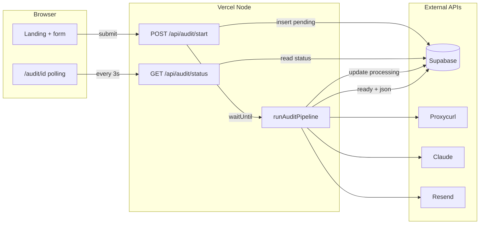

# LinkedIn Audit (`linkedin-audit`)

**Product (RU UI):** A dark-themed landing page and funnel for a **free AI audit** of LinkedIn profiles aimed at **Russian-speaking professionals** targeting **US/EU** roles. The user submits a public profile URL → the app runs a **server-side pipeline** (Proxycurl + parallel Claude analyses) → the UI shows a **severity score** and **top 3 insights**; a **full report** is emailed via **Resend**. The product tone is direct (“immigrant signals” recruiters notice in seconds).

**Repository:** [github.com/zobnin8-ux/linked](https://github.com/zobnin8-ux/linked)

---

## Table of contents

- [Features](#features)
- [Tech stack](#tech-stack)
- [Architecture](#architecture)
- [Prerequisites](#prerequisites)
- [Getting started](#getting-started)
- [Environment variables](#environment-variables)
- [Database (Supabase)](#database-supabase)
- [HTTP API](#http-api)
- [Audit pipeline](#audit-pipeline)
- [PostHog analytics](#posthog-analytics)
- [SEO & public routes](#seo--public-routes)
- [Project structure](#project-structure)
- [Deployment (Vercel)](#deployment-vercel)
- [Security](#security)
- [Troubleshooting](#troubleshooting)
- [Scripts](#scripts)
- [License](#license)

---

## Features

- **Landing:** Hero, “what we find”, how it works, FAQ (accordion), footer with privacy link.
- **Audit form:** LinkedIn URL (validated), email, optional target role, required consent; client-side UX with inline Zod errors.
- **Funnel:** `POST /api/audit/start` creates an audit row and kicks off a **background job** with `waitUntil` → redirect to `/audit/[id]`.
- **Result page:** Polling `/api/audit/status` every 3s; processing UI with animated stages; **ready** shows score + top insights + masked email; **failed** shows friendly copy; optional slow-path copy after ~90s.
- **Rate limiting:** 5 starts per IP per hour (Supabase `rate_limits` table).
- **Email:** React Email template + Resend for full report delivery.

---

## Tech stack

| Layer | Technology |
|--------|------------|
| Framework | **Next.js 15** (App Router), **React 19**, **TypeScript** |
| Styling | **Tailwind CSS v4** (`@import "tailwindcss"` in `app/globals.css`) |
| UI | Radix-based primitives (`components/ui/*`), **Framer Motion** on hero / progress |
| Validation | **Zod** (`lib/validators.ts`) |
| Database | **Supabase** (Postgres) — **service role only** on server routes |
| LinkedIn data | **Proxycurl** (`lib/proxycurl.ts`) |
| AI | **Anthropic Claude** via `@anthropic-ai/sdk` (`lib/claude.ts`) |
| Email | **Resend** + **react-email** v6 (`lib/resend.ts`, `lib/email-templates/`) |
| Analytics | **PostHog** (browser + optional server key) |
| Hosting | **Vercel** — `waitUntil` from `@vercel/functions`, `maxDuration` on start route |

---

## Architecture



- **No n8n / Inngest** in this repo: orchestration is **in-process** on Vercel after the HTTP response returns.

---

## Prerequisites

- **Node.js 20.x** (see `engines` in `package.json`; Vercel: set **Node.js Version → 20.x** in project settings).
- **npm** (or compatible client).
- **Supabase** project + SQL migration applied.
- API keys: **Proxycurl**, **Anthropic**, **Resend** (and verified sender domain in Resend).

---

## Getting started

```bash
git clone https://github.com/zobnin8-ux/linked.git
cd linked
npm install
cp .env.example .env.local
# Edit .env.local — see table below
npm run dev
```

Open [http://localhost:3000](http://localhost:3000).

Run a production build locally:

```bash
npm run build
npm run start
```

---

## Environment variables

Copy [`.env.example`](./.env.example) to `.env.local` for local development. On Vercel, add the same keys under **Project → Settings → Environment Variables**.

| Variable | Required | Description |
|----------|----------|-------------|
| `NEXT_PUBLIC_SUPABASE_URL` | **Yes** (funnel) | Supabase project URL |
| `SUPABASE_SERVICE_ROLE_KEY` | **Yes** (funnel) | Server-only key; **never** expose to the client |
| `NEXT_PUBLIC_SUPABASE_ANON_KEY` | No* | Not used for audit DB access in MVP; optional for future client Supabase |
| `PROXYCURL_API_KEY` | **Yes** (pipeline) | Bearer token for Proxycurl |
| `ANTHROPIC_API_KEY` | **Yes** (pipeline) | Anthropic API key |
| `ANTHROPIC_MODEL` | No | Defaults in code (e.g. Sonnet); override if needed |
| `RESEND_API_KEY` | **Yes** (email) | Resend API key |
| `RESEND_FROM_EMAIL` | **Yes** (email) | Verified sender, e.g. `audit@yourdomain.com` |
| `NEXT_PUBLIC_APP_URL` | Recommended | Public site URL (OG metadata, links in email) |
| `NEXT_PUBLIC_POSTHOG_KEY` | No | Client-side PostHog |
| `NEXT_PUBLIC_POSTHOG_HOST` | No | Default `https://eu.posthog.com` if unset |
| `POSTHOG_SERVER_KEY` | No | Server-side PostHog capture |

\*The landing “completed audits count” uses the service client; without Supabase it falls back to `0`.

---

## Database (Supabase)

Apply the migration in the Supabase SQL editor (or CLI):

**File:** [`supabase/migrations/001_init.sql`](./supabase/migrations/001_init.sql)

**Tables:**

- **`audits`** — one row per submission: `linkedin_url`, `email`, `target_role`, `status` (`pending` \| `processing` \| `ready` \| `failed`), `severity_score`, `top_3_insights`, `full_report`, `raw_profile`, `error_message`, `ip_address`, `user_agent`, timestamps.
- **`rate_limits`** — sliding-window style rows for IP + endpoint enforcement.

**RLS:** MVP assumes **no RLS**; all access is via **service role** on the server. Do not use the service role key in client bundles.

---

## HTTP API

### `POST /api/audit/start`

- **Body (JSON):** `{ "linkedin_url": string, "email": string, "target_role"?: string, "consent": boolean }`
- **Validation:** Zod (`lib/validators.ts`); LinkedIn must match `linkedin.com/in/...`.
- **Rate limit:** 5 requests / IP / hour → **429** when exceeded.
- **Success:** `{ "audit_id": string }` (UUID).
- **Side effect:** Inserts `audits` row (`pending`), then **`waitUntil(runAuditPipeline(audit_id))`**.
- **Config:** `export const maxDuration = 300` in route; see [`vercel.json`](./vercel.json) for function duration on Vercel.

### `GET /api/audit/status?id=<uuid>`

- **Public** by audit id (share-friendly URL).
- **Returns:** `status`, optional `severity_score`, `top_3_insights`, `email_masked`, `error`.
- **Does not return:** raw profile, full email, or LinkedIn URL from this endpoint (privacy-minded teaser page).

---

## Audit pipeline

**Entry:** [`lib/audit-pipeline.ts`](./lib/audit-pipeline.ts) — `runAuditPipeline(auditId)`.

**Rough flow:**

1. Set `status = processing`.
2. Load audit row (URL, email, role).
3. **Proxycurl** → fetch public profile JSON → store in `raw_profile`.
4. **Four parallel Claude calls** with JSON-only prompts (`lib/prompts/*`): detect signals, headline, about, experience.
5. Merge + dedupe insights → compute **`severity_score`** and **top 3** (`lib/claude.ts`).
6. Update row: `status = ready`, `severity_score`, `top_3_insights`, `full_report`, `completed_at`.
7. **Resend** email with React Email template [`lib/email-templates/full-report.tsx`](./lib/email-templates/full-report.tsx).

**Failure:** Sets `failed` + user-facing `error_message`; PostHog server event if configured.

**Retries:** Claude calls include parse + `jsonrepair` retry logic inside `lib/claude.ts` (per product spec).

---

## PostHog analytics

**Client (when `NEXT_PUBLIC_POSTHOG_KEY` is set):** e.g. `landing_viewed`, `audit_form_submitted`, `audit_processing_started`, `audit_ready_viewed`, `audit_failed`, `share_clicked` — see [`components/posthog-provider.tsx`](./components/posthog-provider.tsx) and [`app/audit/[id]/audit-view.tsx`](./app/audit/[id]/audit-view.tsx).

**Server (when `POSTHOG_SERVER_KEY` is set):** pipeline lifecycle and failure events in [`lib/audit-pipeline.ts`](./lib/audit-pipeline.ts) / [`lib/posthog.ts`](./lib/posthog.ts).

---

## SEO & public routes

- **Metadata:** [`app/layout.tsx`](./app/layout.tsx) — title, description, Open Graph, Twitter card.
- **OG image:** [`app/opengraph-image.tsx`](./app/opengraph-image.tsx) (dynamic).
- **`robots.txt`:** [`app/robots.ts`](./app/robots.ts) — allow `/`, disallow `/audit/*`.
- **`sitemap.xml`:** [`app/sitemap.ts`](./app/sitemap.ts) — homepage only.
- **Privacy:** [`app/privacy/page.tsx`](./app/privacy/page.tsx)

---

## Project structure

```
├── app/
│   ├── api/audit/start/route.ts    # POST start + waitUntil
│   ├── api/audit/status/route.ts # GET status (masked email)
│   ├── audit/[id]/                 # Result + polling UI
│   ├── privacy/page.tsx
│   ├── layout.tsx                  # fonts, metadata, PostHog provider
│   ├── page.tsx                    # Landing
│   ├── globals.css
│   ├── opengraph-image.tsx
│   ├── robots.ts
│   └── sitemap.ts
├── components/                     # hero, form, faq, progress, teaser, ui/*
├── lib/
│   ├── audit-pipeline.ts
│   ├── claude.ts
│   ├── proxycurl.ts
│   ├── resend.ts
│   ├── supabase.ts               # server-only service client
│   ├── rate-limit.ts
│   ├── validators.ts
│   ├── posthog.ts
│   ├── prompts/
│   └── email-templates/
├── types/audit.ts
├── supabase/migrations/
├── vercel.json
├── .env.example
└── README.md
```

---

## Deployment (Vercel)

1. **Import** GitHub repo `zobnin8-ux/linked`.
2. **Settings → Build and Deployment → Node.js Version:** **20.x** (matches `engines.node` in `package.json`).
3. **Environment variables:** mirror `.env.example` for Production (and Preview if you test there).
4. **Supabase:** run migration on the linked Supabase project **before** testing the funnel.
5. **Resend:** verify **domain** and `RESEND_FROM_EMAIL`.
6. **Plan:** Long-running background work uses **`waitUntil`** + high `maxDuration`. On **Hobby**, timeouts are tighter — **Pro** is recommended for reliable pipelines (see your product spec).

After deploy, set `NEXT_PUBLIC_APP_URL` to your **Vercel URL** or custom domain so emails and OG URLs are correct.

---

## Security

- **Never** commit `.env.local` or real secrets (gitignored).
- **`SUPABASE_SERVICE_ROLE_KEY`** — server-only (`import "server-only"` in server modules).
- **Public audit URLs** — status endpoint avoids returning raw PII; email is **masked** for display.
- **Rate limiting** on start endpoint reduces abuse.
- **Consent** checkbox is required on the form (legal UX hook; wire your real policy text in `/privacy`).

---

## Troubleshooting

| Symptom | Likely cause |
|---------|----------------|
| Build fails on `Preview` / React Email types | Ensure `react-email` v6 + string children for `<Preview>` (see `full-report.tsx`). |
| `npm run build` ESLint on empty interface | Use `type` alias instead of empty `interface` (see `components/ui/input.tsx`). |
| Form submit fails | Missing or wrong Supabase env; migration not applied; RLS blocking (should be off for MVP). |
| Audit stuck on `processing` / `failed` | Proxycurl key, private profile, Claude key/model, or Resend sender not verified — check Vercel **Runtime Logs** and Supabase row `error_message`. |
| Vercel warning about `engines` | Use pinned **`20.x`** in `package.json` (not `>=20`). |

---

## Scripts

| Command | Description |
|---------|-------------|
| `npm run dev` | Dev server (Turbopack) |
| `npm run build` | Production build |
| `npm run start` | Start production server (after `build`) |
| `npm run lint` | ESLint (Next core-web-vitals) |

---

## License

Private / all rights reserved unless the repository owner specifies otherwise. Contact the maintainer for reuse terms.

---

## Contributing

Internal project for now. For questions about the spec or deployment, open a discussion with the repo owner or update this README when the product name and legal entity are finalized.
